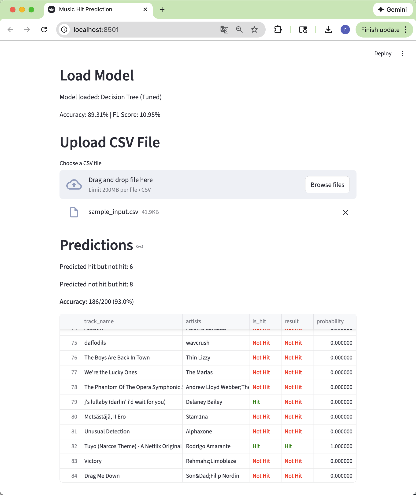

# Music Hit Prediction

A project that predicts whether a song will be a hit song based on Spotify audio features.

## Demo



## Project Structure

```
Music-Hit-Prediction/
├── Notebooks/             # TELLS EVERYTHING
├── App/                   # Streamlit application
├── Data/                  # Dataset for training & testing
├── Model/                 # Trained model and related filesa
├── Scripts/               # Scripts for fetching from APIs
├── Visualizations/        # EDA and evaluation charts
├── Slides                 # Slides for presentation
├── Summary                # The summary of the project
├── assets/                # App screenshots
```

## Quick Start

```bash
pip install streamlit
cd App
streamlit run app.py
```

## Results

| Model | Accuracy | F1 Score |
|-------|----------|----------|
| Decision Tree | 0.9328 | 0.0049 |
| Random Forest | 0.9357 | 0.0000 |
| XGBoost | 0.9353 | 0.0102 |
| **Tuned Decision Tree** | **0.8931** | **0.1095**|
| Tuned Random Forest | 0.9330 | 0.0491 |
| Tuned XGBoost | 0.9355 | 0.0119 |

